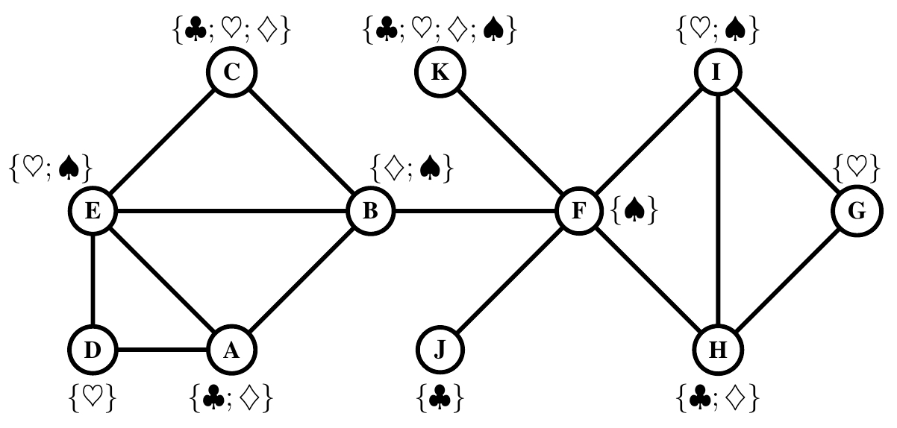
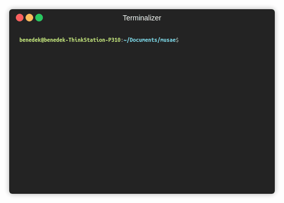

MUSAE   
============================================
The reference implementation of "Multi-scale Attributed Node Embedding."
<p align="center">
  
</p>

### Abstract

<p align="justify">
We present network embedding algorithms that capture information about a node from the local distribution over node attributes around it, as observed over random walks following an approach similar to Skip-gram. Observations from neighborhoods of different sizes are either pooled (AE) or encoded distinctly in a multi-scale approach (MUSAE). Capturing attribute-neighborhood relationships over multiple scales is useful for a diverse range of applications, including latent feature identification across disconnected networks with similar attributes. We prove theoretically that matrices of node-feature pointwise mutual information are implicitly factorized by the embeddings. Experiments show that our algorithms are robust, computationally efficient and outperform comparable models on social, web and citation network datasets.</p>

The second-order random walks sampling methods were taken from the reference implementation of [Node2Vec](https://github.com/aditya-grover/node2vec).

This repository provides the reference implementations for MUSAE and AE as described in the paper:
> Multi-scale Attributed Node Embedding.
> [Benedek Rozemberczki](http://homepages.inf.ed.ac.uk/s1668259/), [Carl Allen](http://homepages.inf.ed.ac.uk/s1577741/), and [Rik Sarkar](https://homepages.inf.ed.ac.uk/rsarkar/).
> arXiv, 2019.
> https://arxiv.org/abs/1909.13021


### Table of Contents

1. [Citing](#citing)  
2. [Requirements](#requirements)
3. [Datasets](#datasets)  
4. [Logging](#logging)  
5. [Options](#options) 
6. [Examples](#examples)

### Citing

If you find MUSAE useful in your research, please consider citing the following paper:

>@misc{rozemberczki2019multiscale,
       title={Multi-scale Attributed Node Embedding},
       author={Benedek Rozemberczki and Carl Allen and Rik Sarkar},
       year={2019},
       eprint={1909.13021},
       archivePrefix={arXiv},
       primaryClass={cs.LG}
       }

### Requirements
The codebase is implemented in Python 3.5.2. package versions used for development are just below.
```
networkx          1.11
tqdm              4.28.1
numpy             1.15.4
pandas            0.23.4
texttable         1.5.0
scipy             1.1.0
argparse          1.1.0
gensim            3.6.0
```
### Datasets

### Logging

The models are defined in a way that parameter settings and runtimes are logged. Specifically we log the followings:

```
1. Hyperparameter settings.     We save each hyperparameter used in the experiment.
2. Optimization runtime.        We measure the time needed for optimization - measured by seconds.
3. Sampling runtime.            We measure the time needed for sampling - measured by seconds.
```

### Options

Learning of the embedding is handled by the `src/main.py` script which provides the following command line arguments.

#### Input and output options

```
  --graph-input      STR   Input edge list csv.     Default is `input/edges/chameleon_edges.csv`.
  --features-input   STR   Input features json.     Default is `input/features/chameleon_features.json`.
  --output           STR   Embedding output path.   Default is `output/chameleon_embedding.csv`.
  --log              STR   Log output path.         Default is `logs/chameleon.json`.
```
#### Random walk options

```
  --sampling      STR       Random walker order (first/second).              Default is `first`.
  --P             FLOAT     Return hyperparameter for second-order walk.     Default is 1.0
  --Q             FLOAT     In-out hyperparameter for second-order walk.     Default is 1.0.
  --walk-number   INT       Walks per source node.                           Default is 5.
  --walk-length   INT       Truncated random walk length.                    Default is 80.
```

#### Model options

```
  --model                 STR        Pooled or multi-scla model (AE/MUSAE).       Default is `musae`.
  --base-model            STR        Use of Doc2Vec base model.                   Default is `null`.
  --approximation-order   INT        Matrix powers approximated.                  Default is 3.
  --dimensions            INT        Number of dimensions.                        Default is 32.
  --down-sampling         FLOAT      Length of random walk per source.            Default is 0.001.
  --exponent              FLOAT      Downsampling exponent of frequency.          Default is 0.75.
  --alpha                 FLOAT      Initial learning rate.                       Default is 0.05.
  --min-alpha             FLOAT      Final learning rate.                         Default is 0.025.
  --min-count             INT        Minimal occurence of features.               Default is 1.
  --negative-samples      INT        Number of negative samples per node.         Default is 5.
  --workers               INT        Number of cores used for optimization.       Default is 4.
  --epochs                INT        Gradient descent epochs.                     Default is 5.
```

### Examples
<p align="center">
  
</p>


Training a MUSAE model for a 10 epochs.
```
python src/main.py --epochs 10
```
Changing the dimension size.
```
python src/main.py --dimensions 32
```
